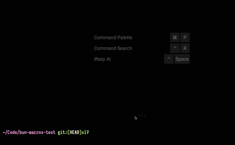

# Bun macros flappy bird

Demonstrating an extremely handy usecase for Bun's [bundle-time-evaluated macros](https://bun.sh/docs/bundler/macros).

Flappy bird code from [here](https://github.com/turbo-turnip/C-Flappy-Bird).

You need sdl2, sdl2_ttf, and sdl2_image to run this.
